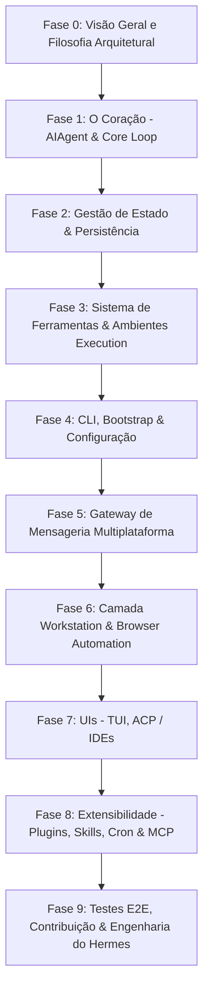

# 🎓 Roadmap de Maestria no Hermes Agent: Do Zero ao Doutorado

Bem-vindo ao plano oficial de estudo e domínio do **Hermes Agent**. Este documento foi elaborado para guiá-lo no estudo profundo de todo o código-fonte, arquitetura, design patterns e subsistemas do repositório.

Ao final deste roadmap, você terá compreensão completa de como o agente executa loops raciocínio-ação, como o cache de prompt é preservado, como a gestão de estado via SQLite/FTS5 opera, como o gateway atende a mais de 20 plataformas de mensageria, como a camada de Workstation e TUI interage com o agente, e como estender o ecossistema com plugins, MCPs e skills.

---

## 🗺️ Visão Geral da Jornada de Aprendizado

---

## 📜 Princípios Fundamentais (Os 2 Mandamentos Arquiteturais)

Antes de abrir qualquer arquivo Python, entenda os dois pilares sagrados do Hermes:

1. **O Cache de Prompt por Conversa é Sagrado:**
   Conversas de longa duração reutilizam um prefixo em cache a cada turno. Qualquer mutação no histórico passado, troca dinâmica do conjunto de ferramentas no meio da conversa ou alteração no `system_prompt` invalida o cache da API e multiplica o custo do usuário.
2. **O Núcleo é Estreito; a Capacidade Vive nas Margens (The Core is a Narrow Waist):**
   Todas as ferramentas registradas no núcleo são enviadas em cada chamada à API de LLM. O sarrafo para adicionar uma nova *tool* no core é altíssimo. Novas capacidades devem ser entregues como comandos CLI + Skills, ferramentas com `check_fn`, plugins ou servidores MCP.

---

## 📚 Fase 0: Visão Geral e Filosofia Arquitetural

### 🎯 Objetivo
Entender o propósito do repositório, o modelo conceitual do Hermes e suas regras de desenvolvimento.

### 📖 Leituras Obrigatórias
1. [README.md](file:///c:/Github/hermes-agent/README.md) - Visão geral do produto e capacidades.
2. [AGENTS.md](file:///c:/Github/hermes-agent/AGENTS.md) - Guia mestre de arquitetura, princípios de design, escopo e convenções de código.
3. [HERMES_WORKSTATION.md](file:///c:/Github/hermes-agent/HERMES_WORKSTATION.md) e [workstation/context/README.md](file:///c:/Github/hermes-agent/workstation/context/README.md) - Contexto da camada Workstation.

### 💡 Exercício Prático da Fase 0
- Rode o comando `python -m pytest tests/` (ou scripts de teste da sua preferência) para validar o ambiente.
- Inspecione a estrutura da pasta raiz e identifique os principais módulos.

---

## 🧠 Fase 1: O Coração - AIAgent & Core Loop

### 🎯 Objetivo
Dominar o ciclo de vida da conversa, chamada de LLM, parse de respostas, invocação de ferramentas (tool calling) e compressão de trajetórias.

### 📖 Arquivos Chave
- [run_agent.py](file:///c:/Github/hermes-agent/run_agent.py) (`AIAgent`, `run_conversation()`, `chat()`)
- [model_tools.py](file:///c:/Github/hermes-agent/model_tools.py) (`handle_function_call()`, `discover_builtin_tools()`)
- [toolsets.py](file:///c:/Github/hermes-agent/toolsets.py) (`_HERMES_CORE_TOOLS`, agrupamentos de ferramentas)
- [trajectory_compressor.py](file:///c:/Github/hermes-agent/trajectory_compressor.py) (mecanismos de resumo/compactação de contexto)
- Módulo [agent/](file:///c:/Github/hermes-agent/agent/) (adaptadores de LLM, fallbacks e utilitários)

### 🔬 Tópicos Avançados para Estudar
- **Ciclo `while` de iteração:** Como o orçamento de iterações (`max_iterations`, `iteration_budget`) é controlado e como funciona a *grace call*.
- **Alternância estrita de papéis:** Garantia de intercalação `user` -> `assistant` -> `tool` sem duplicar mensagens do mesmo papel.
- **Formatação de Tool Calls:** Como o formato de resposta das ferramentas é empacotado e retornado ao modelo.
- **Compressão de histórico:** Como o `trajectory_compressor.py` preserva memória sem quebrar a coerência da conversa.

### 💡 Exercício Prático da Fase 1
- Faça um trace manual da função `run_conversation()` acompanhando o fluxo de uma mensagem com invocação de ferramentas (ex: `read_file` -> `run_command`).

---

## 💾 Fase 2: Gestão de Estado & Persistência

### 🎯 Objetivo
Compreender como o Hermes armazena sessões, histórico de mensagens, metadados e busca textual completa.

### 📖 Arquivos Chave
- [hermes_state.py](file:///c:/Github/hermes-agent/hermes_state.py) (`SessionDB` - controle da base SQLite, criação e manutenção de tabelas)
- [hermes_state_schema.py](file:///c:/Github/hermes-agent/hermes_state_schema.py) (estruturas de dados e schemas das tabelas)
- [hermes_state_search.py](file:///c:/Github/hermes-agent/hermes_state_search.py) (indexação e busca FTS5)
- [hermes_state_portability.py](file:///c:/Github/hermes-agent/hermes_state_portability.py) (importação/exportação e migração de estado)
- [hermes_state_common.py](file:///c:/Github/hermes-agent/hermes_state_common.py) (funções auxiliares de banco)

### 🔬 Tópicos Avançados para Estudar
- **SQLite + FTS5:** Como o Hermes constrói os índices de busca em texto puro para recuperar trechos de sessões passadas.
- **Atomicidade e Transações:** Mecanismos de escrita segura para prevenir corrupção durante encerramentos abruptos.

### 💡 Exercício Prático da Fase 2
- Inspecione um arquivo `.db` gerado pelo Hermes em `~/.hermes/` (ou crie um em ambiente de testes) usando SQLite CLI ou código Python para ler as tabelas de sessão e mensagens.

---

## 🛠️ Fase 3: Sistema de Ferramentas & Ambientes de Execução

### 🎯 Objetivo
Entender o sistema de registro de ferramentas, runtime de execução e isolamento por ambientes (containers, PTYs locais e remotos).

### 📖 Arquivos Chave
- [tools/registry.py](file:///c:/Github/hermes-agent/tools/registry.py) (decorator de registro de ferramentas e gerenciador de catálogo)
- Pasta [tools/](file:///c:/Github/hermes-agent/tools/) (implementação individual das ferramentas nativas: arquivos, busca web, etc.)
- Pasta [tools/environments/](file:///c:/Github/hermes-agent/tools/environments/) (adaptadores de PTY/Terminal: Local, Docker, SSH, Modal, Daytona, Singularity)

### 🔬 Tópicos Avançados para Estudar
- **Descoberta Dinâmica de Tools:** Como o `registry.py` descobre e valida assinaturas de ferramentas no momento da importação.
- **Validação com `check_fn`:** Como ferramentas condicionais evitam inchar o schema quando pré-requisitos (como tokens ou conectores) não estão configurados.
- **Isolamento de Ambiente:** Como comandos do agente são abstraídos para rodar no SO local ou dentro de containers/ambientes remotos.

### 💡 Exercício Prático da Fase 3
- Crie uma ferramenta personalizada de teste seguindo o padrão `@register_tool` com suporte a `check_fn`.

---

## 🖥️ Fase 4: CLI, Bootstrap & Configuração

### 🎯 Objetivo
Entender a experiência do usuário no terminal, resolução de perfis de configuração e inicialização do sistema.

### 📖 Arquivos Chave
- [cli.py](file:///c:/Github/hermes-agent/cli.py) (`HermesCLI` - orquestrador do terminal interativo)
- Pasta [hermes_cli/](file:///c:/Github/hermes-agent/hermes_cli/) (subcomandos, assistente de setup, gerenciador de plugins)
- [hermes_bootstrap.py](file:///c:/Github/hermes-agent/hermes_bootstrap.py) (inicialização de ambiente e checagem de dependências)
- [hermes_constants.py](file:///c:/Github/hermes-agent/hermes_constants.py) (`get_hermes_home()`, resolução de paths por perfil)
- [hermes_logging.py](file:///c:/Github/hermes-agent/hermes_logging.py) (configuração de logs isolados por perfil)

### 🔬 Tópicos Avançados para Estudar
- **Resolução de Perfis:** Como o Hermes isola rotas de configuração (`~/.hermes/config.yaml`) e diretórios de log por perfil.
- **Menu e Assistente Interativo:** Como `hermes setup` e `hermes tools` gerenciam preferências sem expor env vars desnecessárias.

---

## 🌐 Fase 5: Gateway de Mensageria Multiplataforma

### 🎯 Objetivo
Compreender como o Hermes se conecta a Telegram, Discord, Slack, WhatsApp e mais de 20 plataformas de comunicação simultaneamente.

### 📖 Arquivos Chave
- [gateway/run.py](file:///c:/Github/hermes-agent/gateway/run.py) (ponto de entrada do gateway)
- [gateway/session.py](file:///c:/Github/hermes-agent/gateway/session.py) (gerenciamento de sessões contínuas por plataforma/chat)
- Pasta [gateway/platforms/](file:///c:/Github/hermes-agent/gateway/platforms/) (adaptadores individuais de cada plataforma)

### 🔬 Tópicos Avançados para Estudar
- **Mapeamento de Sessão por Plataforma:** Como IDs de mensagens e conversas de Telegram/Discord são traduzidos para `session_id` no Hermes.
- **Roteamento de Eventos e Hooks:** Ciclo de vida de escuta, tratamento de webhook/polling e dispatch de respostas.

### 💡 Exercício Prático da Fase 5
- Leia a documentação em `gateway/ADDING_A_PLATFORM.md` e acompanhe a implementação da plataforma Telegram ou Webhook.

---

## 💻 Fase 6: Camada Workstation & Browser Automation

### 🎯 Objetivo
Entender as extensões proprietárias do produto Workstation, automação de navegador e roteamento visual.

### 📖 Arquivos Chave
- Módulo [workstation/](file:///c:/Github/hermes-agent/workstation/) (`ARCHITECTURE.md`, `browser_runtime.py`, `kanban.py`, `perception.py`)
- Módulos [apps/](file:///c:/Github/hermes-agent/apps/) e [web/](file:///c:/Github/hermes-agent/web/)

### 🔬 Tópicos Avançados para Estudar
- **Controle de Navegador Dedicado:** Como o `browser_runtime` interage com o navegador de área de trabalho e executa automações com sessões autenticadas.
- **Integração de Painéis e Kanban:** Fluxos multi-agentes orientados a quadro de tarefas e métricas locais.

---

## 🎨 Fase 7: UIs - TUI, ACP / IDEs & Web

### 🎯 Objetivo
Aprender como a interface em modo texto (TUI), os adaptadores para IDEs e o frontend web se comunicam com o núcleo Python.

### 📖 Arquivos Chave
- Pasta [ui-tui/](file:///c:/Github/hermes-agent/ui-tui/) (Interface Ink/React em TypeScript para o terminal)
- Pasta [tui_gateway/](file:///c:/Github/hermes-agent/tui_gateway/) (Servidor JSON-RPC em Python que expõe o agente para a TUI)
- Módulo [acp_adapter/](file:///c:/Github/hermes-agent/acp_adapter/) (Servidor Agent Communication Protocol para VS Code, Zed e JetBrains)
- Módulo [website/](file:///c:/Github/hermes-agent/website/) (Documentação e Docusaurus)

### 🔬 Tópicos Avançados para Estudar
- **Comunicação JSON-RPC:** Como a TUI interage com `tui_gateway` via stdout/stdin ou soquetes em tempo real.
- **Especificações TypeScript:** Padrões de código React/Ink e gerenciamento de estado minimalista (nanostores).

---

## 🧩 Fase 8: Extensibilidade - Plugins, Skills, Cron & MCP

### 🎯 Objetivo
Dominar as formas oficiais de estender o Hermes sem inflar a Toolset core.

### 📖 Arquivos Chave
- Pasta [plugins/](file:///c:/Github/hermes-agent/plugins/) (plugins de memória como Mem0, Honcho, provedores de inferência, observabilidade)
- Pastas [skills/](file:///c:/Github/hermes-agent/skills/) e [optional-skills/](file:///c:/Github/hermes-agent/optional-skills/) (habilidades procedimentais guiadas por `SKILL.md`)
- Módulo [cron/](file:///c:/Github/hermes-agent/cron/) (`scheduler.py`, `jobs.py` - agendamento de tarefas recorrentes)
- [mcp_serve.py](file:///c:/Github/hermes-agent/mcp_serve.py) e [optional-mcps/](file:///c:/Github/hermes-agent/optional-mcps/) (servidor e cliente Model Context Protocol)

### 🔬 Tópicos Avançados para Estudar
- **A Escada de Pegada (Footprint Ladder):** Entender quando usar CLI Command + Skill vs Service-gated Tool vs Plugin vs MCP Server.
- **Estrutura de um Plugin:** Arquivos `manifest.json`, registro de hooks e carregamento isolado em `~/.hermes/plugins/`.

---

## 🧪 Fase 9: Testes, E2E e Contribuição como Mestre

### 🎯 Objetivo
Escrever testes robustos, validar comportamento sem falsos positivos e contribuir com código de nível produção.

### 📖 Arquivos Chave
- Pasta [tests/](file:///c:/Github/hermes-agent/tests/) (~17 mil testes pytest)
- [scripts/run_tests.sh](file:///c:/Github/hermes-agent/scripts/run_tests.sh) (script mestre de execução de testes)
- [CONTRIBUTING.md](file:///c:/Github/hermes-agent/CONTRIBUTING.md) (regras de Pull Request e qualificação de contribuição)

### 🔬 Regras de Ouro nos Testes
- **Testes de Comportamento x Snapshots:** Evite testes "detector de mudanças" que congelam valores estáticos. Teste invariantes e relações de dados.
- **Validação E2E com Real Imports:** Para resolução de caminhos ou segurança, exercite o caminho real contra um `HERMES_HOME` temporário em vez de abusar de mocks.

---

## 🏆 Checklist de Maestria: Torne-se um "Doutor em Hermes Agent"

Marque cada conquista à medida que avança na sua jornada:

- [ ] **Nível 1 (Aprendiz):** Consigo explicar como `run_agent.py` executa o loop raciocínio-ação e envia mensagens para a LLM.
- [ ] **Nível 2 (Iniciado):** Compreendo como as tabelas do `SessionDB` (`hermes_state.py`) salvam o histórico e como a busca FTS5 localiza conversas passadas.
- [ ] **Nível 3 (Desenvolvedor de Tools):** Criei uma ferramenta nativa customizada com suporte a `check_fn` e integridade de schema.
- [ ] **Nível 4 (Mestre em Gateway):** Tracei o fluxo completo de uma mensagem vinda do Telegram ou Discord até o agente e de volta para o chat.
- [ ] **Nível 5 (Arquiteto de UIs & TUI):** Entendo como o `tui_gateway` expõe a API para o frontend React Ink (`ui-tui`).
- [ ] **Nível 6 (Doutor em Extensibilidade):** Sei criar Skills procedimentais complexas, integrar MCPs externos e criar Plugins sem tocar no core do agente.
- [ ] **Nível 7 (Mestre Contribuidor):** Consigo rodar a suite de testes, identificar gargalos, resolver bugs respeitando o cache de prompt e submeter Pull Requests elegantes.

---

*“O conhecimento do núcleo é o mapa; a capacidade nas margens é o destino.”* 🚀
